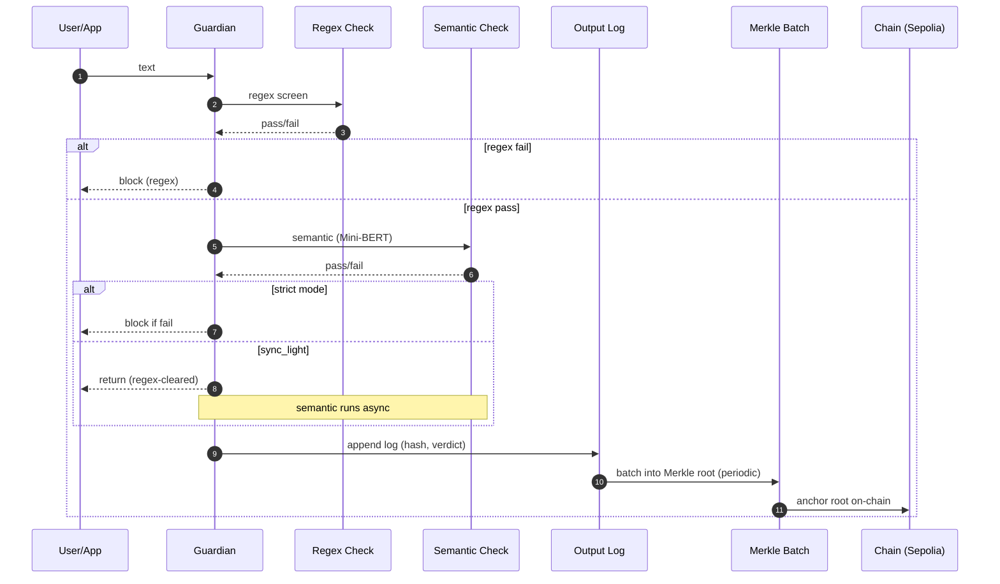
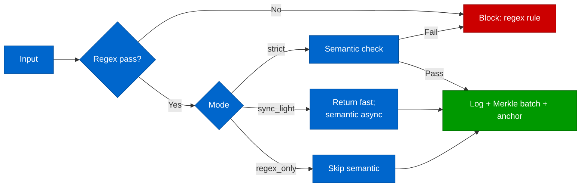

# CANDELA Visuals (lightweight)

Palette (RGB):
- Blue (outputs): `rgb(0,102,204)`
- Green (pass to Guardian): `rgb(0,153,0)`
- Red (stop/block): `rgb(204,0,0)`

## Guardian flow (sequence)

## Mode selection (flow)

Descriptions:
- Guardian flow shows input through regex and semantic checks, with strict vs sync_light branching, then logging, Merkle batching, and anchoring.
- Mode selection highlights outcomes with color cues: blue (processing/output path), green (pass/anchor), red (block).
