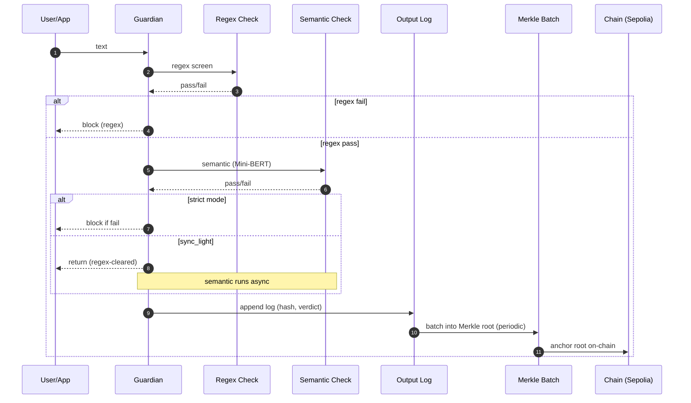
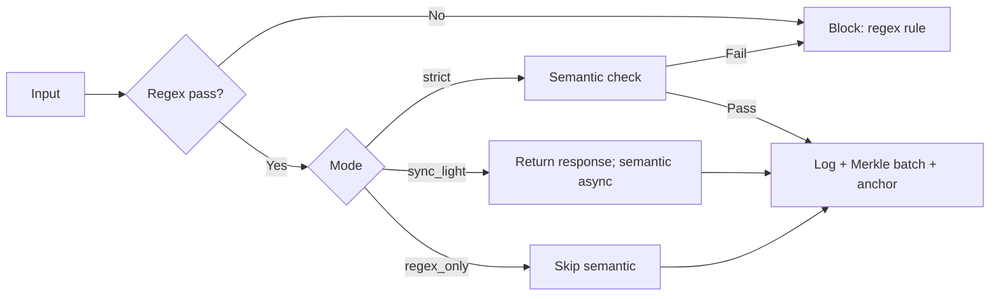

# CANDELA Visuals (lightweight)

## Guardian flow (sequence)

## Mode selection (flow)

These diagrams avoid extra dependencies (rendered by GitHub Mermaid). For a static illustration of “allowed vs blocked” intents, prefer an offline PNG/SVG generated during docs build to keep runtime deps lean.
